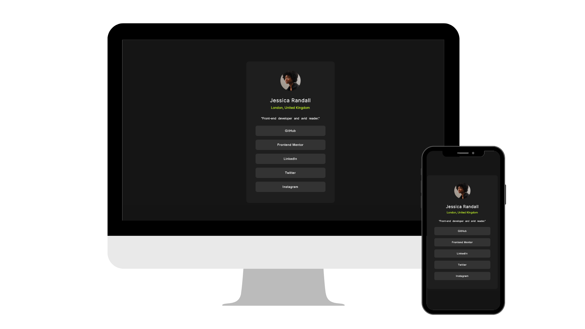

# Social Links Profile

A responsive social links profile project built using HTML5 and SASS. This project allows users to showcase links to their profiles on various social media platforms through an aesthetically pleasing and user-friendly card. The design ensures seamless functionality on both mobile and desktop devices.

## Features
- Responsive design catering to both mobile and desktop platforms.
- Display of links to the user's profiles on different social media networks.
- Utilizes HTML5 and CSS3 for structure and styling.

## Technologies Used 🛠️
-  HTML5: Markup language for structuring the web page.
-  CSS3: Styling language for design and presentation.
-  Sass: CSS extension language with additional features.

## Usage Instructions
1. Clone this repository.
2. Navigate to the project directory.
3. Open the `index.html` file in your web browser to view the social links profile.
4. Explore the responsiveness as you resize your browser window or view it on different devices.

## Customization
Feel free to customize and enhance the social links profile project according to your preferences:

- Modify the links and icons to feature different social media profiles.
- Experiment with various color schemes, typography, and visual elements.
- Add any additional sections or features to improve the overall user experience.

## Contributions
Contributions are welcome! If you have ideas for improvements or want to contribute in any way, please submit a pull request.

## Author ✒️
- **Carmenyo** - [carmenyo](https://github.com/carmenyo)
